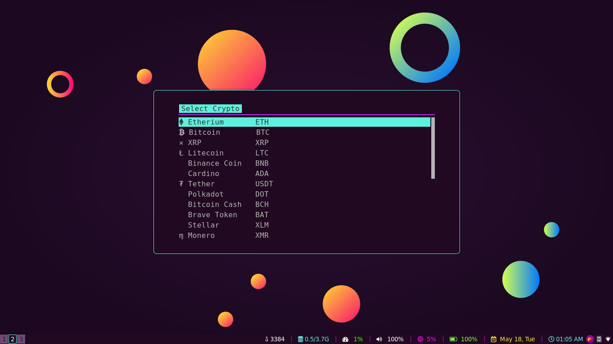
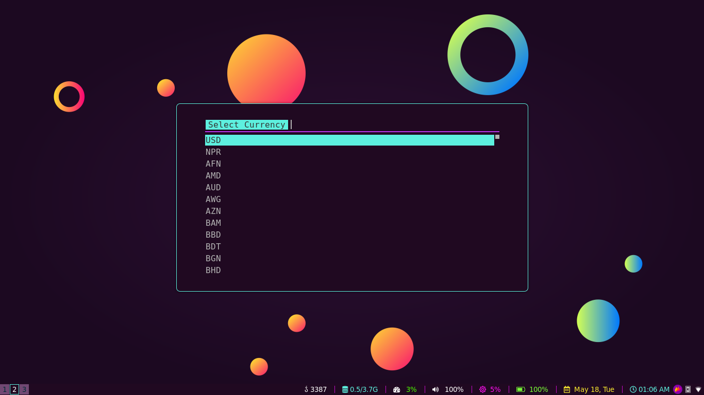

# My Shell Scripts
You can clone this repo or copy individual scripts as per your 
requirement and use the scripts.

## myip
It prints your ip address you your terminal.
```
> myip
192.168.23.1/23
```

## clh
It removes all duplicate commands in your zsh history.
You can modify the history to take history from your bash_history also by simply modifying the script.

```
> clh
Initial History Count
233
Final History Count
173
```

## crypto

It shows all current values of all cryptocurrencies in any currency you like.
For eg. if you want to see value of Bitcoin in USD you can.
It has support for 12 other cryptocurrencies like Etherium , Litecoin,
XRP, Tether, Cardino etc. and you can see its value in more than 100 
different currencies like USD, NRP, INR, AUD etc.

### Requirements
> 1. rofi<br>
> 2. You need to copy the <b>configs</b> folder above also and place it inside <b>~/scripts</b> folder.<br>

So install rofi first to make it work.

```
> crypto
```
Then the following rofi prompts appear<br>

<br>
Finally the result is displayed in the terminal as follow 
```
> crypto
USD 3520
```

## hotspot.sh
Creates hotspot with ssid Hotspot and password <b>hello_world</b>
```
> hotspot.sh
Hotspot Created
Ssid: Hotspot
Password: hello_world
```

## wallpaper.sh
Changes wallpaper for your desktop.<br>
### Requirements
> Feh
<br>
So if you don't have feh. Install it.

### Procedure
It takes images from <b>~/.config/wallpapers</b> folder.
Create the folder and place some <b>jpg</b> images for wallpapers inside the folder.


In Arch you can do
```
> sudo pacman -S feh
```
### Usage
For next wallpaper
```
> wallpaper.sh
```
For previous 
```
> wallpaper.sh prev
```

